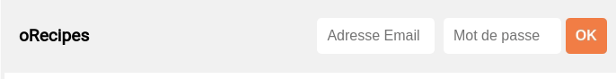

# Recipe Login

Il parait que le serveur nous proposant de merveilleuses recettes nous propose également de nous connecter avec le compte d'utilisateurs ayant des recettes favorites.

Faisons les curieux et essayons de nous connecter pour faire tout ça

## Objectifs

- Créer un `reducer` dédié à la partie `auth` de l'appli
- Créer un `middleware` pour gérer cette authentification
- Utiliser le composant `LoginForm` fournit et le brancher via un `container`
- Lire le props du composant pour mieux comprendre ses attentes ;)
- Déclencher la connexion au serveur `React-recipes-server`
- **POST** http://localhost:3001/login : en passant `email` et `password`

### Utilisateurs

- `bouclierman@herocorp.io` / `jennifer`
- `acidman@herocorp.io` / `fructis`
- `captain.sportsextremes@herocorp.io` / `pingpong`
  