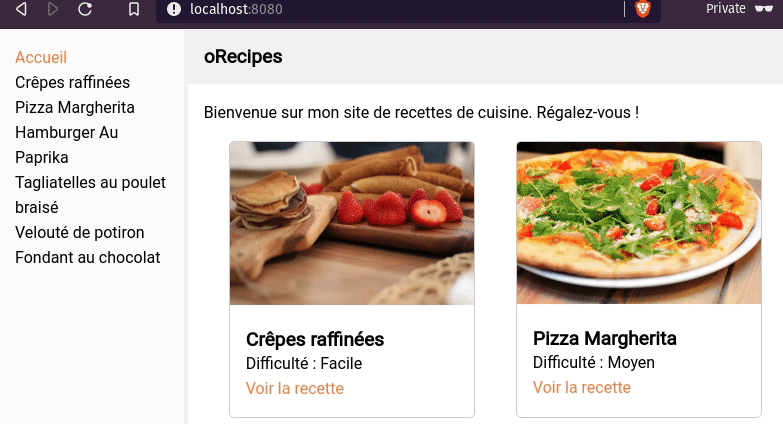

# oRecipes

Amusons-nous avec React, Redux, React Router :tada:

## Objectif

## Instructions

- Commencer par du statique
- Poser les props
- Utiliser les data statiques
- Utiliser le router pour les différentes vues
